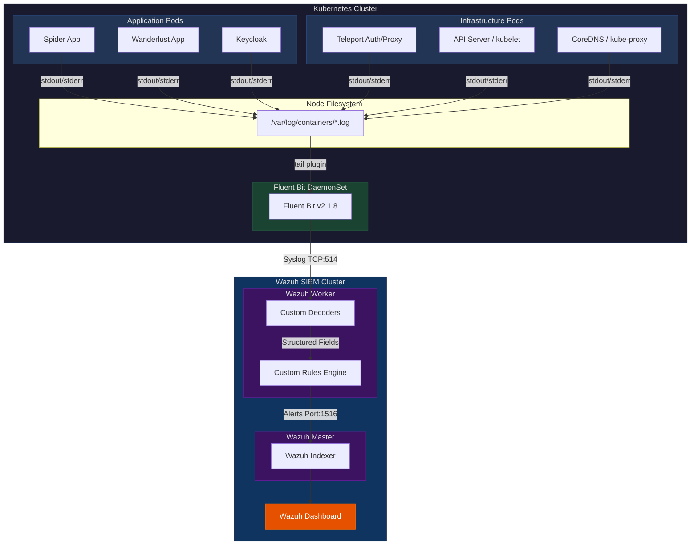
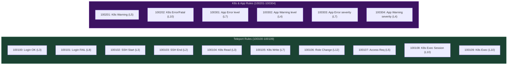

# Wazuh SIEM Implementation Document

**Project:** Centralized Security Information and Event Management (SIEM) for Kubernetes  
**Platform:** Wazuh 4.x on Kubernetes (AKS)  
**Date:** June 2026  

---

## Table of Contents

1. [Executive Summary](#1-executive-summary)
2. [What We Are Doing](#2-what-we-are-doing)
3. [Why We Need This](#3-why-we-need-this)
4. [Architecture Overview](#4-architecture-overview)
5. [Architecture Diagram](#5-architecture-diagram)
6. [How the Pipeline Works (Step-by-Step)](#6-how-the-pipeline-works-step-by-step)
7. [Implementation Details](#7-implementation-details)
   - 7.1 [Wazuh Platform Deployment](#71-wazuh-platform-deployment)
   - 7.2 [Fluent Bit Log Collector](#72-fluent-bit-log-collector)
   - 7.3 [Custom Decoders](#73-custom-decoders)
   - 7.4 [Custom Rules & Severity Levels](#74-custom-rules--severity-levels)
8. [Log Sources & What They Capture](#8-log-sources--what-they-capture)
9. [Rule Reference Table](#9-rule-reference-table)
10. [Severity Level Guide](#10-severity-level-guide)
11. [Challenges & Bug Fixes](#11-challenges--bug-fixes)
12. [Verification & Testing](#12-verification--testing)
13. [File Inventory](#13-file-inventory)
14. [Future Roadmap](#14-future-roadmap)

---

## 1. Executive Summary

We have implemented a **centralized SIEM (Security Information and Event Management)** solution using **Wazuh** to monitor our entire Kubernetes cluster. The system collects, parses, and alerts on security events from three major log sources:

- **Teleport** — Access control and identity audit logs
- **Application Services** — Custom microservice logs (e.g., Spider, Wanderlust)
- **Kubernetes Infrastructure** — Control plane and cluster component logs

The solution uses an **agentless architecture** powered by **Fluent Bit DaemonSets**, eliminating the need to install heavyweight agents inside every pod. Logs are collected at the node level, enriched with Kubernetes metadata, forwarded to Wazuh via Syslog, and parsed through custom decoders and rules to trigger real-time security alerts.

---

## 2. What We Are Doing

We are building a **real-time security monitoring and alerting pipeline** that:

1. **Collects** every log line from every container in the Kubernetes cluster automatically
2. **Enriches** each log with Kubernetes context (which pod, which namespace, which container)
3. **Forwards** the enriched logs to the Wazuh SIEM engine
4. **Decodes** the raw log text into structured, searchable fields using custom decoders
5. **Evaluates** each decoded log against a ruleset to determine if it represents a security event
6. **Alerts** the security/DevOps team through the Wazuh Dashboard with severity-graded notifications

---

## 3. Why We Need This

| Problem | How SIEM Solves It |
|---|---|
| **No visibility into who accessed what** | Teleport audit logs are captured and parsed — every login, SSH session, K8s exec, and privilege change is tracked |
| **Application crashes go unnoticed** | Any app logging `"level": "error"` or `"severity": "fatal"` triggers an immediate alert |
| **Kubernetes infrastructure failures are silent** | Control plane `klog` errors (API server, kubelet) are detected and alerted on automatically |
| **Compliance audits require audit trails** | All events are indexed with timestamps, users, source IPs, and severity levels — ready for SOC2/ISO 27001 |
| **Manual log checking doesn't scale** | The pipeline is fully automated — no human needs to SSH into a pod to check logs |

---

## 4. Architecture Overview

The architecture consists of four layers:

### Layer 1: Log Generation
Every container in the cluster writes logs to `stdout`/`stderr`. The container runtime (`containerd`) captures this output and writes it to disk at `/var/log/containers/*.log` on each physical node.

### Layer 2: Log Collection & Enrichment (Fluent Bit)
Fluent Bit runs as a DaemonSet (one pod per node). It tails all container log files, parses the CRI format, enriches logs with Kubernetes metadata (pod name, namespace, container name), and forwards them to Wazuh via Syslog over TCP port 514.

### Layer 3: Log Analysis (Wazuh Engine)
The Wazuh Worker receives the Syslog stream and runs each log through:
- **Decoders** → Extract structured fields from raw text
- **Rules** → Evaluate fields against threat patterns and assign severity levels
- Alerts are forwarded to the Wazuh Master for indexing.

### Layer 4: Storage & Visualization (Wazuh Dashboard)
The Wazuh Master stores alerts in the Wazuh Indexer (OpenSearch). The Wazuh Dashboard provides a web UI to search, filter, and visualize security events.

---

## 5. Architecture Diagram



---

## 6. How the Pipeline Works (Step-by-Step)

Here is the exact journey of a single log line from creation to alert:

### Example: A Teleport user "Alice" fails to login

**Step 1 — App Writes Log**  
Teleport prints to stdout:
```json
{"event":"user.login","user":"Alice","success":false,"client_ip":"192.168.1.55","time":"2026-06-25T10:00:00Z"}
```

**Step 2 — Container Runtime Saves to Disk**  
`containerd` writes this to:
```
/var/log/containers/teleport-auth-pod-xyz_teleport_auth-abc123.log
```

**Step 3 — Fluent Bit Tails the File**  
Fluent Bit's `tail` input plugin detects the new line immediately (refresh interval: 5 seconds). It strips the CRI timestamp/stream prefix using the `cri` parser.

**Step 4 — Fluent Bit Enriches with Metadata**  
The Kubernetes filter attaches context:
- `kubernetes.namespace_name` = `teleport`
- `kubernetes.pod_name` = `teleport-auth-pod-xyz`
- `kubernetes.container_name` = `auth`

**Step 5 — Fluent Bit Forwards via Syslog**  
The enriched log is packaged into RFC 3164 Syslog format with `app_name = fluent-bit` and sent over TCP to `wazuh-workers.wazuh.svc.cluster.local:514`.

**Step 6 — Wazuh Decoder Translates**  
The `teleport-audit` decoder recognizes the `"event":"` pattern and uses `JSON_Decoder` to extract:
- `event` = `user.login`
- `user` = `Alice`
- `success` = `false`

**Step 7 — Wazuh Rule Evaluates**  
Rule `100101` matches: *event = user.login AND success = false*.  
→ Triggers **Level 8 Alert**: `"Teleport: Failed login for Alice"`

**Step 8 — Alert Indexed & Displayed**  
The alert is sent to the Wazuh Master → stored in the Indexer → visible on the Wazuh Dashboard under Security Events.

---

## 7. Implementation Details

### 7.1 Wazuh Platform Deployment

Wazuh was deployed on Kubernetes using official Helm charts/manifests from the `wazuh-kubernetes` repository. The deployment includes:

| Component | Pod | Purpose |
|---|---|---|
| Wazuh Master | `wazuh-manager-master-0` | Central rule engine, alert aggregation, cluster coordinator |
| Wazuh Worker | `wazuh-manager-worker-0` | Receives syslog input, runs decoders and rules |
| Wazuh Indexer | `wazuh-indexer-0` | Stores alerts (OpenSearch-based database) |
| Wazuh Dashboard | `wazuh-dashboard-*` | Web UI for searching and visualizing security events |

All components run in the `wazuh` namespace.

---

### 7.2 Fluent Bit Log Collector

Deployed as a **DaemonSet** in the `wazuh-log-collector` namespace.

**Key Configuration:**

| Section | Setting | Purpose |
|---|---|---|
| **INPUT (tail)** | `Path: /var/log/containers/*.log` | Tails ALL container logs on the node |
| **INPUT (systemd)** | `kubelet.service`, `containerd.service` | Captures node-level system logs |
| **FILTER (kubernetes)** | `Merge_Log: On` | Enriches logs with pod name, namespace, container name |
| **FILTER (modify)** | `Add app_name fluent-bit` | Tags all logs with `fluent-bit` so Wazuh's root decoder catches them |
| **OUTPUT (syslog)** | `Host: wazuh-workers...`, `Port: 514`, `Mode: tcp` | Forwards to Wazuh Worker via Syslog |
| **PARSER (cri)** | Regex to strip CRI prefix | Removes containerd timestamp/stream metadata |

**Kubernetes Manifests:**
- `fluent-bit-config.yaml` — ConfigMap with Fluent Bit and Parser configuration
- `fluent-bit-daemonset.yaml` — DaemonSet spec (image: `fluent/fluent-bit:2.1.8`)
- `fluent-bit-rbac.yaml` — ServiceAccount and RBAC permissions

**Resource Allocation:**
- Requests: `100m CPU`, `200Mi Memory`
- Limits: `500m CPU`, `500Mi Memory`

---

### 7.3 Custom Decoders

Decoders are defined in `/var/ossec/etc/decoders/local_decoder.xml` on both Wazuh Manager pods. They translate raw Syslog text into structured fields.

#### Decoder 1: Root Decoder (`fluent-bit`)
```xml
<decoder name="fluent-bit">
  <program_name>^fluent-bit</program_name>
</decoder>
```
**Purpose:** Entry point. Catches every log tagged with `program_name = fluent-bit` and routes it to child decoders.

#### Decoder 2: Teleport Audit (`teleport-audit`)
```xml
<decoder name="teleport-audit">
  <parent>fluent-bit</parent>
  <prematch>"event":"</prematch>
  <plugin_decoder>JSON_Decoder</plugin_decoder>
</decoder>
```
**Purpose:** Identifies Teleport logs by the presence of `"event":"`. Automatically extracts all JSON keys (`event`, `user`, `success`, `client_ip`, `method`, etc.) into Wazuh fields.

#### Decoder 3: Application JSON (`fluent-bit-app-json`)
```xml
<decoder name="fluent-bit-app-json">
  <parent>fluent-bit</parent>
  <prematch>^{</prematch>
  <plugin_decoder>JSON_Decoder</plugin_decoder>
</decoder>
```
**Purpose:** Catches any JSON log that starts with `{`. Extracts keys like `level`, `message`, `severity`, and `timestamp` for application error detection.

#### Decoder 4: Plain Text Fallback (`fluent-bit-app-text`)
```xml
<decoder name="fluent-bit-app-text">
  <parent>fluent-bit</parent>
  <regex>^(\S+) (\S+) (.*)$</regex>
  <order>level, module, message</order>
</decoder>
```
**Purpose:** Catches non-JSON, non-klog text logs and extracts the first word as `level`, second as `module`, and the rest as `message`.

#### Decoder 5: Kubernetes klog (`k8s-klog`)
```xml
<decoder name="k8s-klog">
  <parent>fluent-bit</parent>
  <prematch>^[IWEF]\d{4} \d{2}:\d{2}:\d{2}\.\d+ \s*\d+ </prematch>
  <regex>^([IWEF])(\d{4} \d{2}:\d{2}:\d{2}\.\d+) \s*(\d+) (\S+:\d+)] (.*)$</regex>
  <order>klog_level, klog_time, klog_pid, klog_source, klog_msg</order>
</decoder>
```
**Purpose:** Parses the Kubernetes `klog` format used by API Server, kubelet, kube-proxy, etc. Extracts:
- `klog_level` — Severity letter: `I`(Info), `W`(Warning), `E`(Error), `F`(Fatal)
- `klog_time` — Timestamp
- `klog_pid` — Process ID
- `klog_source` — Source file and line number (e.g., `server.go:456`)
- `klog_msg` — The actual error message

---

### 7.4 Custom Rules & Severity Levels

Rules are defined in `/var/ossec/etc/rules/` on both Wazuh Manager pods. They evaluate decoded fields and trigger alerts.

#### Teleport Rules (`teleport_rules.xml`)

| Rule ID | Level | Trigger Condition | Description |
|---|---|---|---|
| 100100 | 3 (Low) | `event=user.login` AND `success=true` | Successful Teleport login |
| 100101 | 8 (High) | `event=user.login` AND `success=false` | **Failed login attempt** |
| 100102 | 3 (Low) | `event=session.start` | SSH session started |
| 100103 | 2 (Low) | `event=session.end` | SSH session ended |
| 100104 | 3 (Low) | `event=kube.request` AND `verb=get/list/watch` | K8s read-only access |
| 100105 | 7 (High) | `event=kube.request` AND `verb=create/delete/update/patch` | **K8s write operation** |
| 100106 | 12 (Critical) | `event=role.created/role.deleted/user.roles_changed` | **Privilege escalation / role change** |
| 100107 | 5 (Medium) | `event=access_request.created/reviewed` | Access request workflow |
| 100108 | 10 (Critical) | Session start with `kubernetes_pod_name` present | **Interactive K8s exec session** |
| 100109 | 10 (Critical) | `event=exec` | **K8s exec command execution** |

#### Kubernetes & Application Rules (`kubernetes_rules.xml`)

| Rule ID | Level | Trigger Condition | Description |
|---|---|---|---|
| 100201 | 5 (Medium) | `klog_level=W` | Kubernetes cluster warning |
| 100202 | 10 (Critical) | `klog_level=E` or `klog_level=F` | **Kubernetes cluster error/fatal** |
| 100301 | 7 (High) | `level` matches `error/fatal/critical` (case-insensitive) | **Application error (JSON `level` field)** |
| 100302 | 4 (Low) | `level` matches `warn/warning` | Application warning (JSON `level` field) |
| 100303 | 7 (High) | `severity` matches `error/fatal/critical` | **Application error (JSON `severity` field)** |
| 100304 | 4 (Low) | `severity` matches `warn/warning` | Application warning (JSON `severity` field) |

---

## 8. Log Sources & What They Capture

| Source | Log Format | Decoder Used | What Is Captured |
|---|---|---|---|
| **Teleport** | Structured JSON | `teleport-audit` | Logins (success/fail), SSH sessions, K8s API requests, exec sessions, role changes, access requests |
| **Spider / Wanderlust / Custom Apps** | JSON or Plain Text | `fluent-bit-app-json` or `fluent-bit-app-text` | Application errors, warnings, crash logs, request logs |
| **API Server / kubelet / kube-proxy** | klog format | `k8s-klog` | Control plane errors, scheduling failures, node health issues |
| **Keycloak** | JSON | `fluent-bit-app-json` | Authentication errors, realm configuration changes |
| **ClickHouse / Redis** | Plain Text | `fluent-bit-app-text` | Database errors, connection failures |
| **kubelet / containerd (systemd)** | Systemd journal | Direct via systemd input | Node-level service failures |

---

## 9. Rule Reference Table



---

## 10. Severity Level Guide

Wazuh uses a 0–15 severity scale. We mapped our rules to the following levels:

| Level | Classification | Our Usage | Dashboard Color |
|---|---|---|---|
| 0–1 | Ignored / No alert | — | — |
| 2–3 | Low Severity | Successful logins, SSH session start/end, K8s read operations | ⬜ Low |
| 4–5 | Medium Severity | Application warnings, access requests, K8s cluster warnings | 🟡 Medium |
| 7–8 | High Severity | Application errors, K8s write operations, failed logins | 🟠 High |
| 10 | Critical | K8s infrastructure errors, interactive exec sessions | 🔴 Critical |
| 12 | Critical (Elevated) | Privilege escalation, role creation/deletion | 🔴 Critical |
| 13–15 | Reserved | Not currently used — reserved for future high-priority rules | 🔴 Critical |

---

## 11. Challenges & Bug Fixes

### Bug #1: Fluent Bit Whitespace Injection

> [!WARNING]
> **Problem:** Fluent Bit's Syslog output plugin occasionally injects leading whitespace before the log payload (e.g., `fluent-bit:  {"level":"error"}`). Wazuh's default decoders expected the `{` to be the very first character, causing 100% of JSON logs to silently fail parsing.

**Root Cause:** The Syslog RFC 3164 format allows padding between the program name header and the message body. Fluent Bit's implementation adds variable whitespace.

**Solution:** Rewrote the decoder `prematch` patterns to use **PCRE2 regex**:
- JSON decoder: `^\s*\{` (allow any leading spaces before `{`)
- klog decoder: `^\s*[IWEF]` (allow any leading spaces before the severity letter)

This fixed the pipeline with zero performance impact.

### Bug #2: Decoder Priority Conflict

**Problem:** The generic `fluent-bit-app-json` decoder was accidentally matching Teleport logs before the `teleport-audit` decoder could process them, stripping the Teleport-specific context.

**Solution:** Ordered the decoders so `teleport-audit` (with the more specific `"event":"` prematch) is evaluated **before** the generic `^{` JSON decoder. Wazuh evaluates child decoders in order — first match wins.

---

## 12. Verification & Testing

| Test | Action | Expected Result | Actual Result | Status |
|---|---|---|---|---|
| Teleport Login Alert | Created and deleted a Teleport role (`test-wazuh-role`) | Level 12 alert for `role.created` and `role.deleted` | ✅ Alert fired with correct user and event | **PASS** |
| Application Error Alert | Deployed a busybox pod printing `{"level":"error","message":"Simulated app crash"}` | Level 7 alert for Application Error (JSON) | ✅ Alert fired, JSON fields extracted correctly | **PASS** |
| Decoder Parsing | Checked `alerts.json` on Wazuh Worker for structured field extraction | All JSON keys present as named fields | ✅ Fields `event`, `user`, `level`, `message` all present | **PASS** |
| Fluent Bit Health | Checked Fluent Bit DaemonSet logs | Active `inotify_fs_add` entries for container log files | ✅ Actively tailing logs from all namespaces | **PASS** |

---

## 13. File Inventory

All implementation files are stored in the `wazuh_siem/` directory:

| File | Type | Purpose |
|---|---|---|
| `local_decoder.xml` | Decoder Config | All 5 custom decoders (deployed to `/var/ossec/etc/decoders/` on Wazuh) |
| `teleport_decoders.xml` | Decoder Config | Original Teleport decoder (superseded by `local_decoder.xml`) |
| `teleport_rules.xml` | Rule Config | 10 Teleport-specific alerting rules (deployed to `/var/ossec/etc/rules/`) |
| `kubernetes_rules.xml` | Rule Config | 6 K8s infrastructure + application alerting rules |
| `fluent-bit-wazuh.yaml` | K8s Manifest | Original Fluent Bit DaemonSet (v1) |
| `fluent-bit-wazuh-v2/` | K8s Manifests | Production Fluent Bit deployment (ConfigMap, DaemonSet, RBAC) |
| `wazuh-kubernetes/` | K8s Manifests | Wazuh platform Helm charts/deployment manifests |
| `wazuh_siem_implementation_guide.md` | Documentation | Implementation summary for stakeholders |
| `wazuh_conversation_export.md` | Documentation | Full conversation log of the implementation process |

---

## 14. Future Roadmap

| Priority | Task | Description |
|---|---|---|
| 🔴 High | **External Alert Notifications** | Integrate Wazuh with Slack/PagerDuty/Email so Level 10+ alerts are pushed to the DevOps team in real-time instead of sitting silently on the Dashboard |
| 🟡 Medium | **Index Lifecycle Management (ILM)** | Configure automatic deletion/archival of alerts older than 90 days to prevent the Wazuh Indexer from running out of disk space |
| 🟡 Medium | **Vulnerability Detection** | Enable Wazuh's built-in Vulnerability Detector module to scan cluster nodes against NVD/CVE databases |
| 🟢 Low | **Active Response** | Configure automated responses (e.g., block an IP after 5 failed login attempts) |
| 🟢 Low | **File Integrity Monitoring (FIM)** | Monitor critical configuration files on nodes for unauthorized changes |

---

> [!IMPORTANT]
> **Deployment Note:** All custom decoders and rules must be synchronized across both `wazuh-manager-master-0` and `wazuh-manager-worker-0`. After any modification, restart the Wazuh engine on both pods:
> ```bash
> kubectl exec -n wazuh wazuh-manager-master-0 -- /var/ossec/bin/wazuh-control restart
> kubectl exec -n wazuh wazuh-manager-worker-0 -- /var/ossec/bin/wazuh-control restart
> ```
