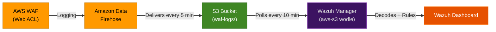

# AWS WAF → Wazuh SIEM Integration Plan

## Goal

Integrate AWS WAF (Web Application Firewall) logs with our existing Wazuh SIEM so that firewall events — blocked requests, SQL injection attempts, XSS attacks, and rate-limiting triggers — are visible and alertable on the Wazuh Dashboard alongside our existing Teleport, Application, and K8s logs.

---

## Architecture

Unlike our Kubernetes logs (which flow through Fluent Bit → Syslog), WAF logs use a **completely different pipeline**:

```
AWS WAF → Amazon Data Firehose → S3 Bucket → Wazuh aws-s3 Module (polls S3) → Wazuh Engine
```

Wazuh has a **built-in AWS module** (`aws-s3` wodle) that natively understands how to pull WAF logs from an S3 bucket. We don't need Fluent Bit for this — Wazuh talks directly to AWS.



---

## Proposed Changes

### Phase 1: AWS Infrastructure Setup (~15 min)

#### 1.1 Create S3 Bucket for WAF Logs
- Create a bucket (e.g., `your-company-waf-logs`)
- Enable versioning (recommended for audit trails)

#### 1.2 Create Amazon Data Firehose Delivery Stream
- **Source:** Direct PUT
- **Destination:** S3 bucket from Step 1.1
- **Stream Name:** Must start with `aws-waf-logs-` (AWS requirement)
- **S3 Prefix:** `waf/` (this is what we'll configure in Wazuh)
- **Buffer Interval:** 60 seconds (faster delivery for near-real-time alerting)

#### 1.3 Enable WAF Logging
- Navigate to your Web ACL in the AWS WAF Console
- Under **Logging and metrics** → Enable logging
- Select the Firehose delivery stream created in 1.2

#### 1.4 Create IAM Policy for Wazuh
Wazuh needs read access to the S3 bucket. Create an IAM policy:
```json
{
  "Version": "2012-10-17",
  "Statement": [
    {
      "Effect": "Allow",
      "Action": [
        "s3:GetObject",
        "s3:ListBucket"
      ],
      "Resource": [
        "arn:aws:s3:::your-company-waf-logs",
        "arn:aws:s3:::your-company-waf-logs/*"
      ]
    }
  ]
}
```

> [!IMPORTANT]
> **Authentication Option:** Since our Wazuh runs on Kubernetes (AKS/EKS), the cleanest option is **IAM Roles for Service Accounts (IRSA)** on EKS, or storing AWS credentials as a Kubernetes Secret mounted into the Wazuh Manager pod. We'll decide the approach based on your cluster type.

---

### Phase 2: Wazuh Configuration (~10 min)

#### 2.1 Configure the `aws-s3` Wodle on Wazuh Manager

Add the following block to the Wazuh Master's `ossec.conf` (or the `master.conf` in the Wazuh Kubernetes ConfigMap):

```xml
<wodle name="aws-s3">
  <disabled>no</disabled>
  <interval>10m</interval>
  <run_on_start>yes</run_on_start>
  <skip_on_error>yes</skip_on_error>

  <bucket type="waf">
    <name>your-company-waf-logs</name>
    <path>waf</path>
    <aws_profile>default</aws_profile>
    <!-- Or use: <iam_role_arn>arn:aws:iam::ACCOUNT_ID:role/WazuhS3ReadRole</iam_role_arn> -->
  </bucket>
</wodle>
```

This tells Wazuh: *"Every 10 minutes, check the S3 bucket for new WAF log files under the `waf/` prefix, download them, and feed them into the analysis engine."*

#### 2.2 Mount AWS Credentials (if not using IRSA)

If using static AWS credentials, create a Kubernetes Secret and mount it:
```bash
kubectl create secret generic aws-credentials -n wazuh \
  --from-literal=aws_access_key_id=AKIA... \
  --from-literal=aws_secret_access_key=...
```

Then mount as `/root/.aws/credentials` in the Wazuh Manager pod.

---

### Phase 3: Custom WAF Rules (~10 min)

#### 3.1 Create `waf_rules.xml`

Wazuh has a built-in decoder for AWS WAF logs (since they come through the `aws-s3` wodle with `type="waf"`). We need custom **rules** to classify the events by severity.

| Rule ID | Level | Trigger | Description |
|---|---|---|---|
| 100500 | 3 (Low) | `action=ALLOW` | WAF: Request allowed |
| 100501 | 7 (High) | `action=BLOCK` | **WAF: Request blocked** |
| 100502 | 10 (Critical) | `action=BLOCK` + `terminatingRuleMatchDetails` contains `SQL_INJECTION` | **WAF: SQL Injection blocked** |
| 100503 | 10 (Critical) | `action=BLOCK` + `terminatingRuleMatchDetails` contains `XSS` | **WAF: Cross-Site Scripting blocked** |
| 100504 | 8 (High) | `action=BLOCK` + `terminatingRuleId` matches rate-based rule | **WAF: Rate-limit triggered (possible DDoS/brute-force)** |
| 100505 | 5 (Medium) | `action=COUNT` | WAF: Request matched a COUNT rule (monitoring mode) |

#### 3.2 Deploy Rules to Wazuh Manager Pods

```bash
kubectl cp waf_rules.xml wazuh/wazuh-manager-master-0:/var/ossec/etc/rules/waf_rules.xml
kubectl cp waf_rules.xml wazuh/wazuh-manager-worker-0:/var/ossec/etc/rules/waf_rules.xml
kubectl exec -n wazuh wazuh-manager-master-0 -- /var/ossec/bin/wazuh-control restart
kubectl exec -n wazuh wazuh-manager-worker-0 -- /var/ossec/bin/wazuh-control restart
```

---

### Phase 4: Verification (~5 min)

1. **Trigger a WAF event:** Send a test request to your WAF-protected endpoint with a known bad pattern (e.g., `?id=1' OR '1'='1` to trigger SQL injection detection)
2. **Wait 10-15 minutes** for the logs to flow: WAF → Firehose → S3 → Wazuh polling
3. **Check Wazuh Dashboard:** Filter by `rule.groups: "aws"` or `rule.id: "100501"` to see blocked requests

---

## Open Questions

> [!IMPORTANT]
> **Q1: Which Web ACL(s) do you want to monitor?** Do you have one WAF Web ACL or multiple (e.g., one for the main app, one for the API)?

> [!IMPORTANT]
> **Q2: How does your Wazuh Manager authenticate to AWS?** Options:
> - **IRSA (EKS only):** Cleanest — no static credentials
> - **AWS Credentials File:** Mount a Kubernetes Secret with `AWS_ACCESS_KEY_ID` and `AWS_SECRET_ACCESS_KEY`
> - **EC2 Instance Profile (if Wazuh runs on EC2):** Attach an IAM role to the instance

> [!IMPORTANT]
> **Q3: Is your WAF already logging somewhere?** If you already have WAF logging enabled to a Firehose/S3, we can reuse that bucket instead of creating a new one.

---

## Verification Plan

### Automated
```bash
# Check if Wazuh is pulling from S3
kubectl exec -n wazuh wazuh-manager-master-0 -- grep "aws-s3" /var/ossec/logs/ossec.log | tail -5

# Check for WAF alerts
kubectl exec -n wazuh wazuh-manager-master-0 -- grep "WAF" /var/ossec/logs/alerts/alerts.json | tail -5
```

### Manual
- Trigger a SQL injection test request against the WAF-protected endpoint
- Confirm it appears as a Level 10 alert on the Wazuh Dashboard within 15 minutes
